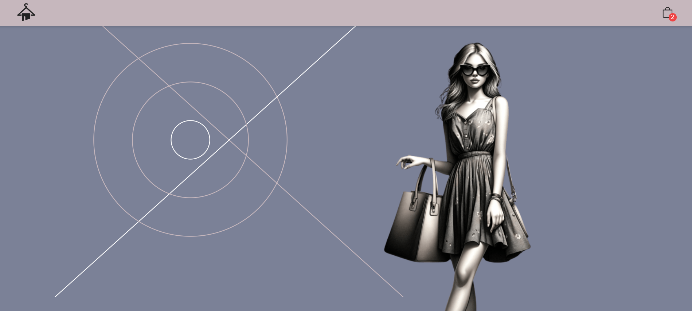

  

<h1 align="center">Hi ✌🏾, I'm Jean-Pierre</h1>
<h3 align="center">A dynamic developer with an eye for design</h3>

  <a href="https://www.jean-pierre.dev/"><strong>Portfolio</strong></a>   
(⌐■_■)

 

---

   &nbsp;&nbsp;&nbsp;&nbsp;&nbsp;
     &nbsp;&nbsp;&nbsp;&nbsp;&nbsp;
  

   &nbsp;&nbsp;&nbsp;&nbsp;&nbsp;
  

---

- 🔭 I’m currently working on projects [Capstone](https://github.com/3mptySpac3/Vita-la-revolution.git) and [30-Thirty](https://github.com/3mptySpac3/30-Thirty.git).
- 🌱 I’m currently learning **React, React Native, PL/SQL, Java**.
- 📫 How to reach me: **jp@jean-pierre.dev**.

---

### Connect with me:

  

### GitHub Trophies

  

  

<h3 align="left">Languages and Tools:</h3>

                             

___
 **** REFRESH ****
### GitHub Stats: (✿◡‿◡)

    
  
  
  

    
  

   

   

  

  

